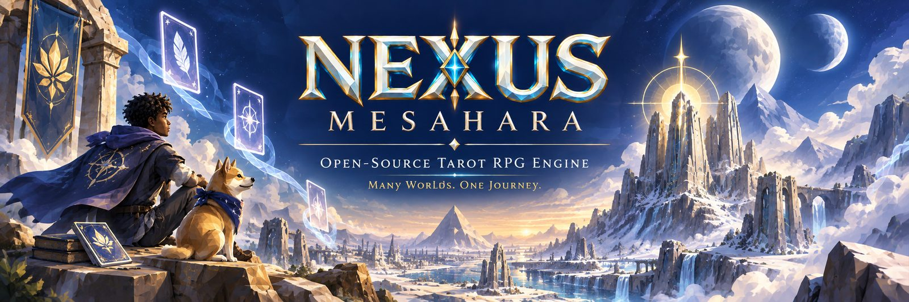
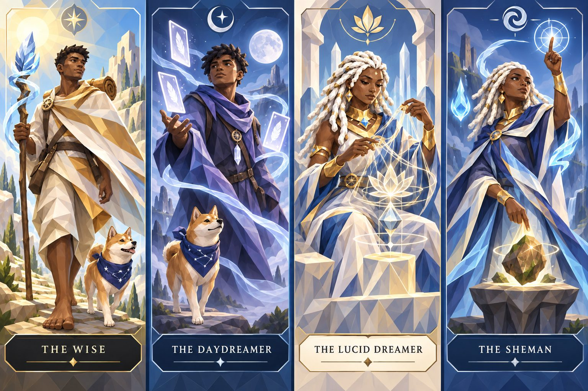

<p align="center">
  <a href="https://sunlight.johnmogi.com/">
    
  </a>
</p>

<p align="center">
  <strong>NEXUS</strong> · Mesahara<br />
  Open-source tarot RPG engine<br />
  <a href="https://sunlight.johnmogi.com/">sunlight.johnmogi.com</a>
</p>

Headless TypeScript rules engine plus an ugly Admin Lab for balancing L0 and L1. Game-core has no React, no database, and no network.

<p align="center">
  
</p>

## Run

```bash
npm install
npm test
npm run lab
```

Lab: [http://localhost:5173/](http://localhost:5173/) — Step, Auto Turn, **Auto Adventure** (full match to OVER), Run 1/10/50/100, export batches. Restart the Lab after pulling so it can load `config/l0.rules.json` / `config/l1.rules.json`.

Toolbar shows **Growth: same lineage only (L0)** vs **Growth: any color (L1)**. If Settings toggled `evolveByColor`, use **Reset to file** to restore the JSON on disk.

```bash
npm run sim -- --seed nexus-test --trace
npm run sim -- --games 10 --seed nexus-test --batch
npm run sim -- --games 100 --seed nexus-test --rules config/l1.rules.json --batch
```

Use `npm run sim`, not `npm sim`. Every batch writes `exports/<timestamp>_<version>_<n>runs/` (`runs.csv`, `summary.json`, `manifest.json`, …).

### Web (Vercel)

Lab deploys as a static Vite build of `apps/lab-ui`. Batch **Export** downloads files in the browser on Vercel (local `npm run lab` still writes under `exports/`).

```bash
npm run build:lab
vercel --prod
```

Project settings are in `vercel.json` (`build:lab` → `apps/lab-ui/dist`).

## Layout

| Path | Role |
|---|---|
| `packages/game-core` | Immutable state, seeded RNG, dispatch, L0/L1 rules compile |
| `packages/sim` | Random-legal policy, CLI, batch export |
| `apps/lab-ui` | Admin Lab (Vite) |
| `packages/cards` | Future catalog adapters (stub) |
| `config/l0.rules.json` | L0: 3 rounds × 3 table advances = **9 turns** |
| `config/l1.rules.json` | L1: 3 rounds × 9 table advances = **27 turns** |
| `graphics/` | Branding, characters, card-art folders — see `graphics/README.md` |
| `exports/` | Simulation reports (gitignored contents) |

## What is in the engine now

- Round Table conveyor: **DRAW → PD → MIDDLE → LEFT**
- Majors never enter a hand; PD, then next-turn Altar
- Lineage is **Ace → +2**. **L0 same lineageId only** (`evolveByColor: false`). **L1 any color** (`evolveByColor: true` — secondary elemental). Illegal Reward dumps go to the Veil
- Ace–6 dealt; 7–9 stay catalog-only
- **L0 deals four Sun lineages** (roses, vines, vessels, crystals) as a soft entry. **L1 deals all eight**
- L1 **day dial**: 2p day/day/night/night; 3p day/night; 4p day/day/night with a per-round shift so a seat is not glued to day. Day +1 sunlight commits, night +1 moonlight commits
- Barrier / Dialogue: hidden COMMIT, then threshold
- Eclipse: **L0** same-face red+black courts on the Altar (pair spent to Veil); **L1** Sun↔Moon titled Major pair on the Altar (or a table pair). Grants **Joker token into hand** (+1). Altar cap is 2. Then L1 offers **Wise / Daydreamer / Lucid Dreamer / Sheman** (impacts pending)
- **20 Majors** in catalog: Sun + Moon Nexus (rank 0) sit in hold, outside the deck; Wise / Daydreamer / Lucid Dreamer / Sheman wait for Eclipse; L1 deals the other 14 (ranks 2 and 4–9)
- Hand limit 7; Veil recycles into draw
- Invariant warnings in the Lab (`MAJOR_IN_HAND`, `INVALID_LINEAGE`, …)

L0 is a short slice (9 table advances, four Sun lines, no table Majors, 2 starting HP). L1 is 27 turns, eight lineages, day dial, 14 table Majors, one combat round. Character impacts are not encoded yet.

## Graphics

Drop new card art into the folders under `graphics/cards/` (Sun/Moon lineages) and `graphics/cards/majors/`. Keep uncompressed originals in `graphics/_source/` (not committed). Compressed splash/poster/characters are already in `graphics/branding/` and `graphics/characters/`.
